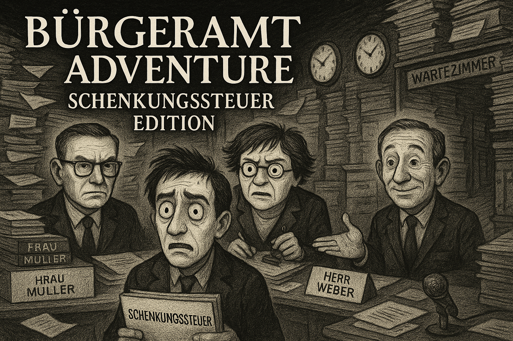

<p align="center">
  
</p>

# Bürgeramt Adventure: Schenkungssteuer Edition

A text-based adventure game powered by AI that simulates the experience of navigating German bureaucracy to process a gift tax (Schenkungssteuer) application.

## Overview

This game puts you in the role of someone trying to navigate the complex German bureaucratic system to process a gift tax application. You'll interact with three distinct AI-powered bureaucrats who will send you back and forth in a maze of forms, requirements, and procedures.

## Characters

- **Herr Schmidt** (Oberamtsrat, Erstbearbeitung): A meticulous rule-follower who speaks in complex legal language and knows every regulation by heart.
- **Frau Müller** (Sachbearbeiterin, Fachprüfung): Always stressed, rushing, and obsessed with deadlines. Uses many abbreviations and is prone to sending people back to the start.
- **Herr Weber** (Verwaltungsangestellter, Abschlussstelle): Friendly but powerless. Genuinely wants to help but has no authority, and always suggests solutions that require going elsewhere.

## Game Mechanics

- Navigate a complex web of interdependent bureaucratic procedures
- Collect necessary documents and provide required evidence
- Try to maintain your sanity as you're sent from one department to another
- Deal with arbitrary rules, missing forms, and officials who always seem to be going on break
- Experience authentic German bureaucratic terms and concepts

## AI-Powered Experience

The game features fully AI-powered bureaucrats:

- Each character has a distinct personality and conversational style
- Every playthrough is unique and unpredictable
- The bureaucrats respond dynamically to your inputs
- The AI creates a truly Kafkaesque experience of bureaucracy
- Natural conversation flow without needing specific keywords

## How to Play

You can start the game using:

```shell
python -m buergeramt
```

You need to provide an OpenAI API key to play. You can either:

```shell
python -m buergeramt --api-key=your_api_key_here
```

Or set it as an environment variable:

```shell
export OPENAI_API_KEY=your_api_key_here
python -m buergeramt
```

Or use a `.env` file as described in the installation section.

### Gameplay

Interact with the bureaucrats by having natural conversations. Try:

- Showing your documents (e.g., "Hier ist mein Personalausweis")
- Asking for forms (e.g., "Ich möchte eine Schenkungsanmeldung")
- Expressing frustration (e.g., "Das ist doch lächerlich!")
- Moving between departments (e.g., "Ich möchte zu Herrn Weber")
- Asking for help (e.g., "Was muss ich als nächstes tun?")

Your goal is to successfully navigate the system and get your gift tax application processed.

## Tips

- Pay attention to what each bureaucrat tells you, even when it seems confusing
- Look for hints about which department you need to visit next
- Keep track of which documents you've collected and what evidence you've provided
- Get creative when stuck - sometimes unorthodox approaches work
- Express frustration to get more helpful responses (especially from Herr Weber)
- Remember that German bureaucracy is not designed to be efficient!

## Installation

1. Clone the repository:

   ```shell
   git clone https://github.com/yourusername/buergeramt.git
   cd buergeramt
   ```

2. Install dependencies using one of the following methods:

   **Using pip with requirements.txt:**

   ```shell
   pip install -r requirements.txt
   ```

## License

This project is open-source and available under the MIT License.

---

*Disclaimer: This game is a satirical interpretation of bureaucratic systems and is meant for entertainment purposes only. Any resemblance to actual bureaucratic procedures is simultaneously coincidental and inevitable.*
